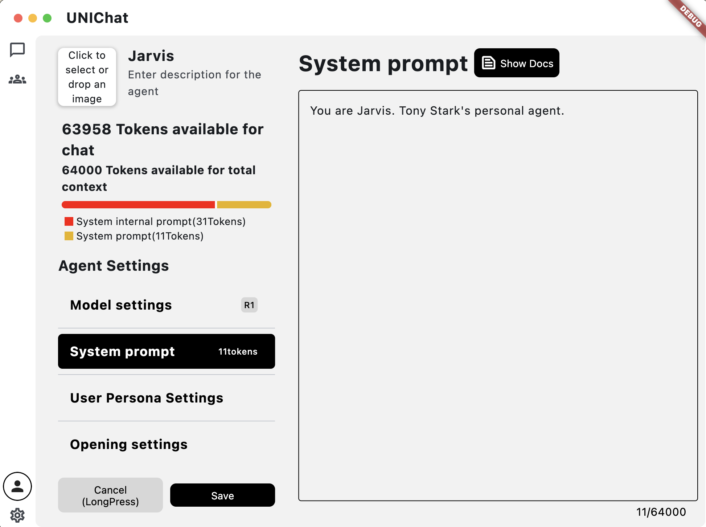
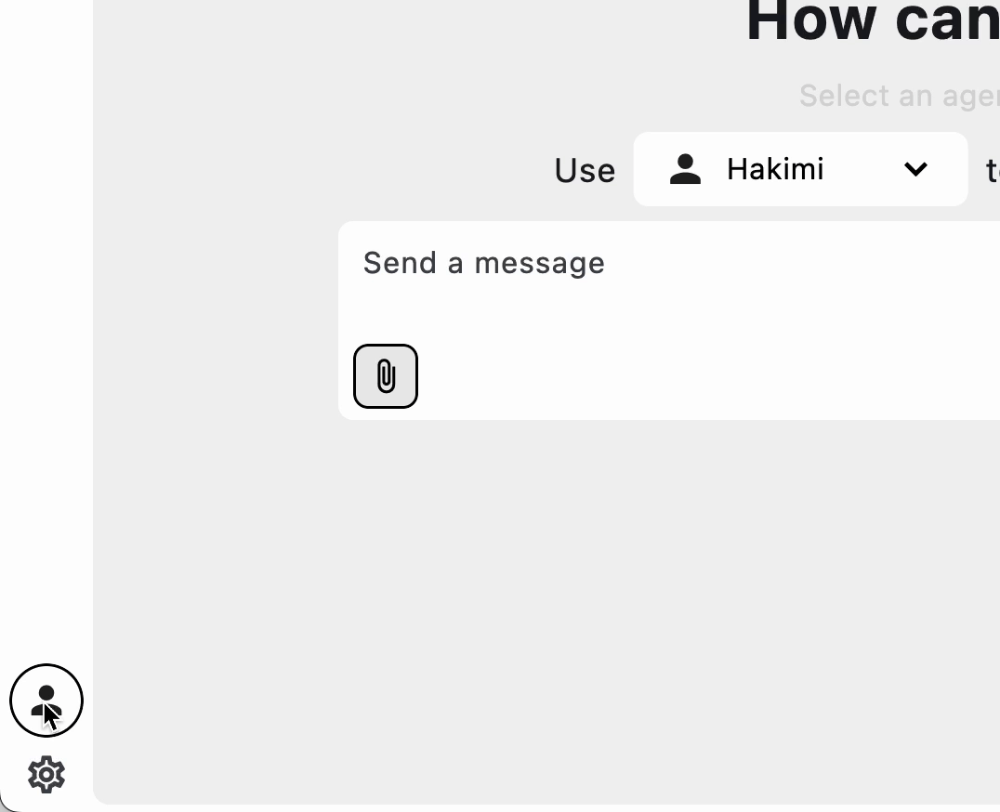
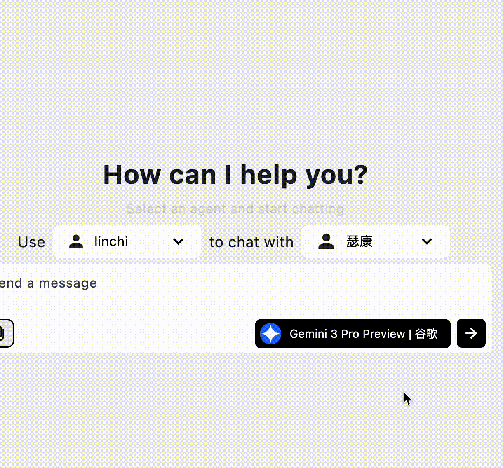

# UNIChat 

> **Think Together — An Agent-level Chat Terminal that Breaks Linear Boundaries.**
>
> 🌐 [Website & Documentation](https://unichat.wejoinnwk.com) | ⬇️ [Download](https://github.com/linchi07/uni_chat/releases) | 📖 [中文版(Chinese)](README_zh.md)

  <video src="website/static/img/homepage/title_en.mp4" autoPlay loop muted playsInline 
      width="800" height="auto" 
    ></video>

## ✨ Core Features

<table align="center" style="text-align:center;">
  <tr>
    <td width="25%">
       
      <b>Agent Architecture</b> 
      Session is Agent. Deeply bound intelligent interactive experience without tedious role switching.
    </td>
    <td width="25%">
       
      <b>Multi-branch Variants</b> 
      Native support for non-linear chat trees. Start branches anytime, compare variants, and master every possibility.
    </td>
    <td width="25%">
       
      <b>Persona System</b> 
      Ultimate identity definition. Define your identity in a single click, creating an immersive interactive environment.
    </td>
    <td width="25%">
       
      <b>API Bundler</b> 
      Built-in presets for DeepSeek, Google, LMStudio, etc. Custom OpenAI-compatible endpoints supported.
    </td>
  </tr>
</table>

## 💻 Native UX on All Platforms

One codebase, extreme optimization. Deeply adapted for macOS, iOS, Windows, and Android.
🍎 🪟 🤖 📱

## 🚀 Download

Choose your operating system to download:
- [Windows](https://github.com/linchi07/uni_chat/releases)
- [macOS](https://unichat.wejoinnwk.com/macos-guide)—Please view our [Installation Guide](https://unichat.wejoinnwk.com/macos-guide) for bypassing unverified developer warnings.
- [Android](https://github.com/linchi07/uni_chat/releases)
- [iOS ](https://github.com/linchi07/uni_chat/wiki/iOS-Installation)

Visit the [Releases page](https://github.com/linchi07/uni_chat/releases) for the latest versions.

## 📖 Documentation

For detailed guides on configuring APIs, creating Agents, and mastering branching, please visit our [official documentation](https://unichat.wejoinnwk.com/docs/intro).

---

