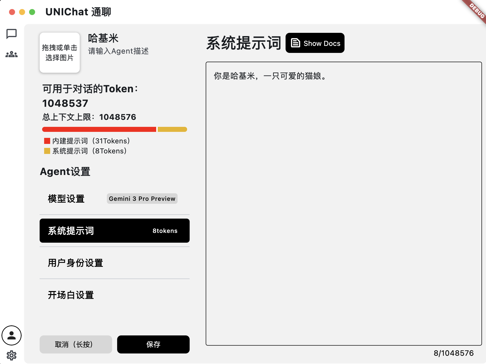
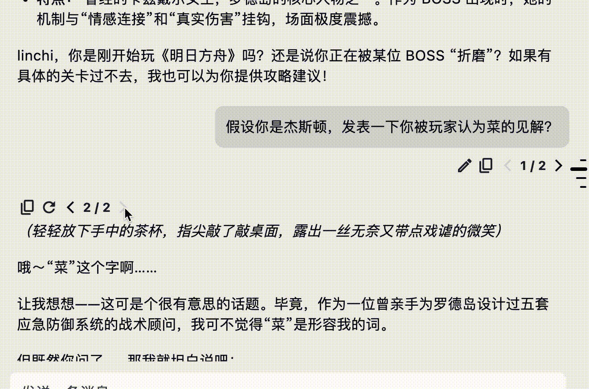
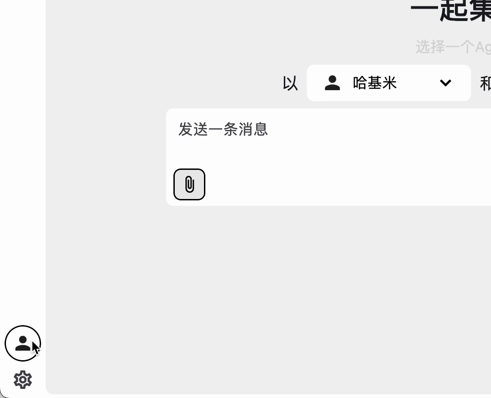
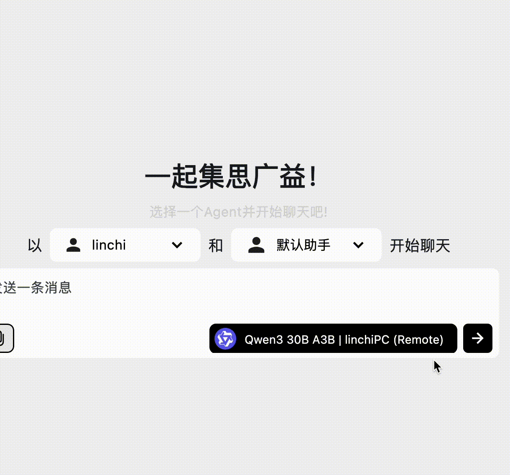

# UNIChat 通聊

> **一起集思广益 — 突破线性限制的 Agent 级对话终端**
>
> 🌐 [官方网站与文档](https://linchi07.github.io/uni_chat) | ⬇️ [立即下载](https://github.com/linchi07/uni_chat/releases) | 📖 [English Version](README.md)

  <video src="website/static/img/homepage/title_cn.mp4" autoPlay loop muted playsInline 
      width="800" height="auto" 
    ></video>

## ✨ 核心特性

<table align="center" style="text-align:center;">
  <tr>
    <td width="25%">
       
      <b>Agent 级架构</b> 
      会话即 Agent。不再是繁琐的角色切换，而是深度绑定的智能交互体验。
    </td>
    <td width="25%">
       
      <b>多分支变体</b> 
      原生支持非线性对话树。随时开启分支，对比不同变体，掌握对话的每一个可能。
    </td>
    <td width="25%">
       
      <b>Persona 系统</b> 
      极致的身份定义。让 Agent 真正理解并记住你的设定，打造极具沉浸感的交互环境。
    </td>
    <td width="25%">
       
      <b>全能 API 聚合</b> 
      内置 DeepSeek, Google, LMStudio 等主流预设。支持自定义 Endpoint，掌控所有模型。
    </td>
  </tr>
</table>

## 💻 全平台原生体验

一套代码，极致优化。深度适配 macOS, iOS, Windows 和 Android，顺滑如丝。
🍎 🪟 🤖 📱

## 🚀 下载

请根据您的操作系统选择下载：
- [Windows](https://github.com/linchi07/uni_chat/releases)
- [macOS](https://unichat.wejoinnwk.com/macos-guide)—关闭macOS未验证警告，请查看 [Installation Guide](https://unichat.wejoinnwk.com/macos-guide).
- [Android](https://github.com/linchi07/uni_chat/releases)
- [iOS (IPA) 安装教程](https://github.com/linchi07/uni_chat/wiki/iOS-Installation)

获取最新版本，请前往 [GitHub Releases](https://github.com/linchi07/uni_chat/releases) 页面。

## 📖 文档

关于如何配置 API、设置专属 Agent 以及掌握高级分支管理，请查阅我们的[官方文档](https://linchi07.github.io/uni_chat/docs/intro)。

---

